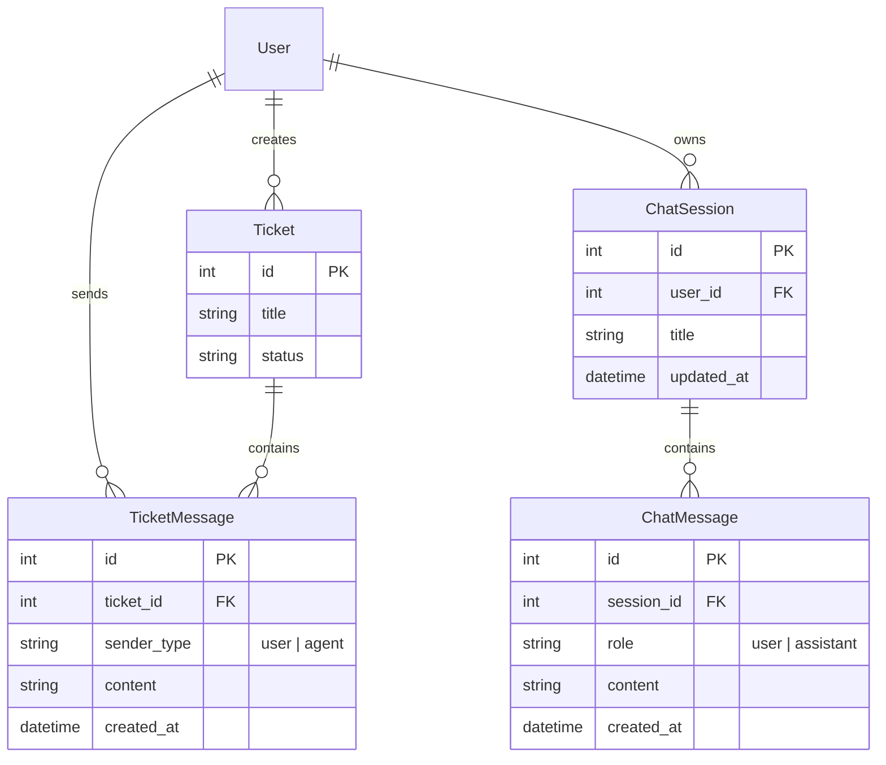
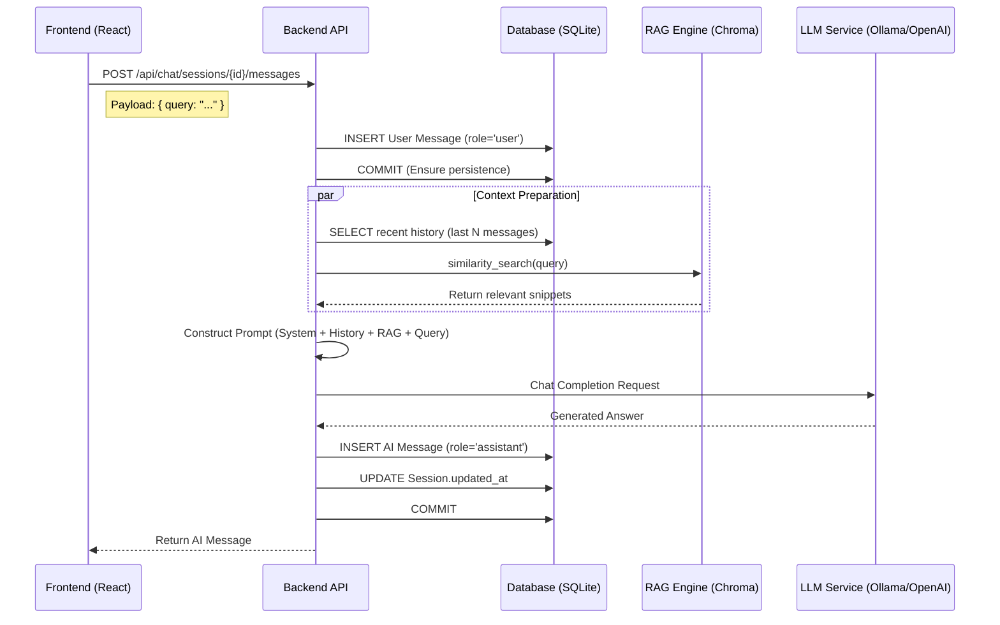

# Lesson 6 · 对话上下文与人机协作

本节课我们将把 AstraTickets 从一个简单的工单系统升级为一个具备**上下文感知能力**和**人机协作**特性的智能客服平台。我们将实现两大核心模块：

1.  **工单对话流 (Ticket Chat)**：将传统的“工单-回复”模式升级为即时通讯风格的“对话流”，并让 AI 建议能够感知完整的历史上下文。
2.  **AI 助手工作台 (AI Assistant Workspace)**：在首页实现一个独立的、支持多轮对话和历史记录持久化的 AI 助手，用于客服人员的日常辅助和知识库查询。

## 技术要点

- **数据模型升级**：
    - **`TicketMessage`**：取代简单的 `Reply` 模型，引入 `sender_type` ('user'/'agent')，支持更细粒度的对话记录。
    - **`ChatSession` & `ChatMessage`**：为 AI 助手设计独立的会话存储模型，支持多会话管理和历史回溯。
- **上下文感知 (Context Awareness)**：
    - **Prompt 增强**：在构建 LLM 提示词时，不再只传入工单描述，而是动态加载并格式化最近的 `N` 条历史消息，让 AI "记住" 之前的对话内容。
- **人机协作 (Human-in-the-loop)**：
    - **AI 预填**：AI 生成的建议不再是后台的黑盒操作，而是直接填充到前端的输入框中，允许人工客服在发送前进行修改和润色。
- **持久化会话管理**：
    - **CRUD 接口**：实现完整的会话创建、查询、删除和消息追加 API，确保用户刷新页面后对话历史不丢失。

## 代码结构

```
backend/app/
│   ├── api/
│   │   ├── messages.py       # 工单消息 API (GET/POST)
│   │   └── chat.py           # AI 助手会话管理 API (Sessions/Messages)
│   ├── db/
│   │   └── models.py         # 新增 TicketMessage, ChatSession, ChatMessage 模型
│   ├── ai/
│   │   ├── llm.py            # 升级 _build_prompt 支持 history 参数
│   │   └── service.py        # 升级 generate_ticket_suggestion 注入历史上下文
│   └── schemas/
│       ├── messages.py       # 工单消息 Pydantic 模型
│       └── chat.py           # AI 助手会话 Pydantic 模型
```

## 运行与演示

### 1. 启动服务

确保后端数据库已更新（`init_models` 会自动创建新表）。

```bash
# 终端 1: 启动后端
make run-backend

# 终端 2: 启动前端
make run-frontend
```

### 2. 体验工单对话流

1.  进入 **Ticket Detail** 页面。
2.  你会发现底部的 "Replies" 区域变成了一个聊天窗口。
3.  **发送消息**：尝试以 Agent 身份发送一条消息。
4.  **AI 协作**：点击 "Generate AI Suggestion"。
    - 观察 AI 生成的建议。
    - 点击 "Apply"，建议内容会自动填充到输入框中。
    - 你可以在发送前修改它。
5.  **上下文测试**：
    - 发送一条消息："That didn't work."
    - 再次生成 AI 建议。
    - AI 应该会根据上下文回答（例如："I'm sorry to hear that..."），而不是重复之前的建议。

### 3. 体验 AI 助手工作台 (Persistent Chat)

1.  回到首页 **Dashboard**。
2.  在 **AI Workspace** 卡片中，你会看到新的会话管理界面。
3.  **新建会话**：点击 "New Chat"。
4.  **多轮对话**：
    - 问："如何重置密码？"
    - 追问："链接过期了怎么办？"
    - AI 会根据上下文回答。
5.  **会话切换**：
    - 再次点击 "New Chat" 开启新话题。
    - 使用下拉菜单切换回之前的会话，验证历史记录是否完整保留。

## 架构与数据流

### 1. 数据库实体关系图 (ERD)

为了支持复杂的对话场景，我们扩展了数据库模型。以下是核心实体及其关系：



### 2. 核心流程：持久化 AI 对话流

当用户在 AI 助手工作台发送消息时，系统执行以下严密的流程：



## 核心实现细节

### 1. 后端：上下文感知的 Prompt 构建

在 `backend/app/ai/llm.py` 中，我们重构了 Prompt 构建逻辑，使其能够动态融合历史对话。这是让 AI 具备"记忆"的关键：

```python
def _build_chat_prompt(
    query: str,
    kb_snippets: List[str],
    history: Sequence[Tuple[str, str]],
) -> str:
    lines = [
        "You are an expert customer support assistant.",
        "INSTRUCTIONS: ... (RAG rules) ...",
        "---"
    ]

    # 关键点：注入历史对话
    if history:
        lines.append("CONVERSATION HISTORY:")
        for role, content in history:
            prefix = "User" if role == "user" else "Assistant"
            lines.append(f"- {prefix}: {content}")
        lines.append("---")

    # 注入知识库片段
    if kb_snippets:
        lines.append("KNOWLEDGE BASE SNIPPETS:")
        for idx, snippet in enumerate(kb_snippets, start=1):
            lines.append(f"Snippet {idx}: {snippet}")
        lines.append("---")

    lines.append(f"USER QUESTION:\n{query}")
    return "\n".join(lines)
```

### 2. 后端：原子性与错误处理

在 `backend/app/api/chat.py` 中，我们特别注意了数据的一致性。即使用户的消息发送成功但 AI 生成失败，用户的消息也应当被保留，以便用户重试或查看。

```python
# 1. 先保存用户消息并提交
user_msg = ChatMessage(session_id=session_id, role="user", content=payload.query)
session.add(user_msg)
session.commit() 

# 2. 执行耗时的 AI 生成过程
try:
    answer = generate_chat_answer(...)
except Exception:
    # 即使失败，用户消息已保存，前端可提示重试
    raise HTTPException(status_code=502, detail="AI generation failed")

# 3. 保存 AI 回复并更新会话时间戳
ai_msg = ChatMessage(session_id=session_id, role="assistant", content=answer)
session.add(ai_msg)
chat_session.updated_at = utcnow() # 标记会话活跃时间
session.commit()
```

### 3. 前端：会话状态管理

在 `frontend/src/pages/Home.tsx` 中，我们使用 React State 管理复杂的会话逻辑：

- **自动加载**：页面加载时自动获取会话列表，并默认选中最近活跃的会话。
- **实时反馈**：发送消息后立即清空输入框并显示 Loading 状态，待后端返回后追加 AI 消息。
- **会话切换**：切换下拉菜单时，触发 `loadSession(id)`，从后端拉取该会话的完整 `messages` 列表替换当前视图。

```typescript
const handleSendMessage = async () => {
  // 1. 乐观 UI 更新（可选，本例采用等待后端返回模式以保证一致性）
  setChatLoading(true)
  
  try {
    // 2. 调用 API
    await chatApi.sendMessage(currentSessionId, payload)
    
    // 3. 重新加载会话以获取最新消息（包含 AI 回复）
    // 这样做的好处是确保前端状态与数据库完全同步
    await loadSession(currentSessionId)
    
    // 4. 刷新列表以更新最后活跃时间
    await fetchChatSessions()
  } catch (error) {
    message.error('Failed to generate AI response')
  } finally {
    setChatLoading(false)
  }
}
```

## 模块深度解析

### `TicketMessage` vs `ChatMessage`

你可能会好奇，为什么我们需要两个相似的消息模型？

- **`TicketMessage`**：
    - **归属**：属于 `Ticket`。
    - **目的**：记录工单处理过程中的正式沟通。
    - **参与者**：User (客户) 和 Agent (客服)。
    - **生命周期**：随工单关闭而结束。

- **`ChatMessage`**：
    - **归属**：属于 `ChatSession` (AI 助手会话)。
    - **目的**：客服人员与 AI 助手的内部辅助对话、知识查询、草稿演练。
    - **参与者**：User (客服人员) 和 Assistant (AI)。
    - **生命周期**：独立于工单，可长期保存，用于知识积累或审计。

这种分离设计保证了业务数据（工单）与辅助工具数据（AI 聊天）的解耦，使得系统架构更加清晰，便于未来的独立扩展（例如将 AI 助手升级为独立的 Copilot 服务）。

## 小结

通过本节课，我们完成了 AstraTickets 的核心交互升级。系统不再是一个冷冰冰的记录工具，而是一个具备记忆、能够理解上下文并与人类高效协作的智能伙伴。

至此，"Enterprise AI Smart Customer Service Ticket System" 的核心教学内容已全部完成！
